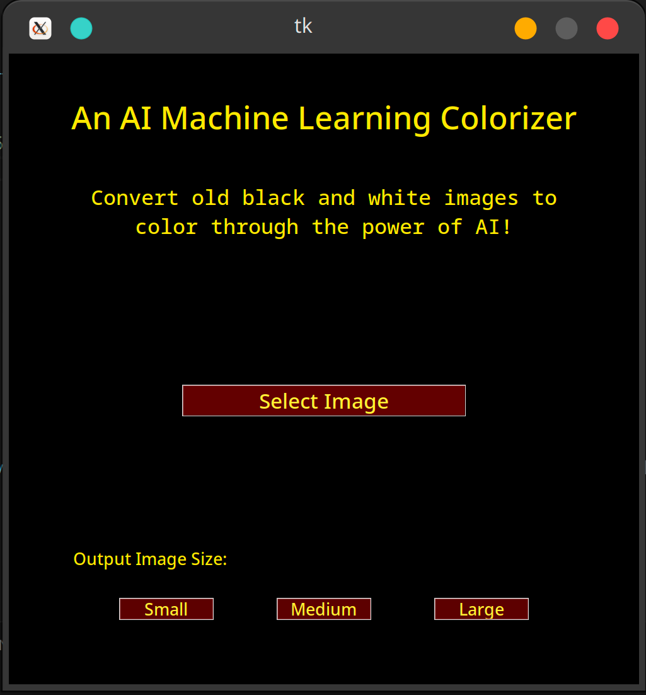
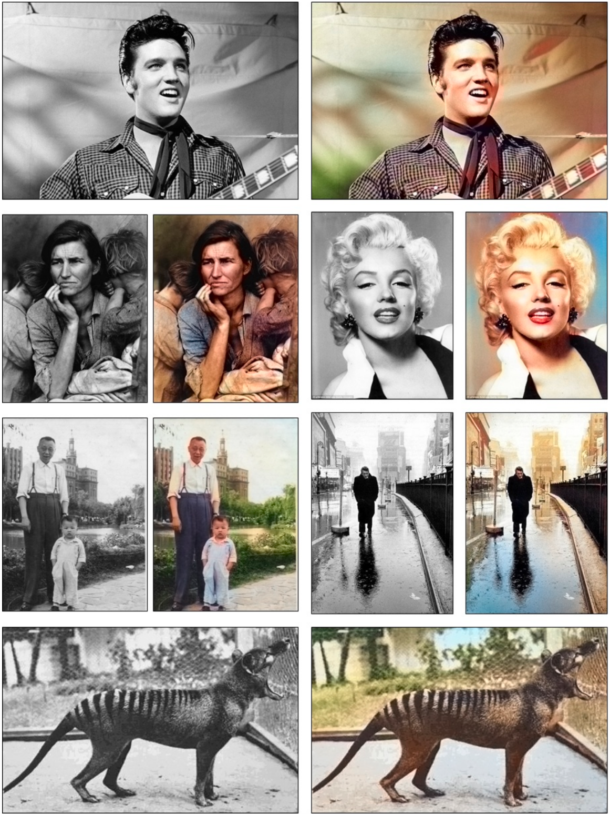

# Colorization

A Python UI that allows the end user to colorize old black-and-white images into RGB colors.

This project is based on the research paper "Deep Learning for Colorization" by Richard Zhang, Phillip Isola, and Alexei A. Efros. Please find their research paper attached as well. Their work, published in 2016, introduced a deep learning-based approach for automatic colorization of black-and-white images, which is leveraged in this project for high-quality colorization.
Machine Learning Strategies Used:

    Deep Neural Networks (DNN): The core of the colorization is powered by a pre-trained DNN model. The model is based on the Caffe neural network architecture and uses a colorization network to predict the missing color channels (a and b) in the Lab color space.

    Transfer Learning: The model is pre-trained on a large dataset of images to learn the underlying relationships between lightness (L) and color channels (a, b). We use the pre-trained weights for the model, thus leveraging transfer learning to avoid retraining from scratch.

    Data Normalization: The model operates in the Lab color space, where the lightness (L) channel is normalized before being passed through the network, ensuring better colorization performance. The a and b channels, which represent color information, are then predicted and combined with the original L channel for colorized output.

    Image Resizing and Preprocessing: The input images are resized to fit the model’s expected input size, ensuring compatibility with the pre-trained model. The processed images are then resized back to the original dimensions for accurate output.

Due to GitHub limitations on file size imports, a necessary component of the program has been uploaded to a personal Google Drive. You must download it in order for the program to function.
To run this program:

    Create a new folder and clone the repository into it.
    Download the .caffemodel file: https://drive.google.com/file/d/1cvU96oNoU0vxsTahucZaRL-4-kOXEv92/view?usp=sharing
    Move the model file into the cloned repository folder.
    Run the Python file.

# Program:

# Sample:

